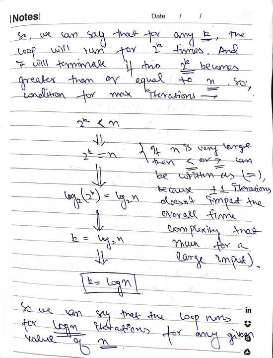

## Time Complexity Analysis for Loops

### Idea:
We assume that every program will eventually terminate at some point (e.g., when `i = k` for a loop).  
Our goal is to find the value of **k** for which the loop ends in the **worst case**.  
That iteration count, expressed in terms of `n` (input size), gives us the **time complexity**.

> **Note (Hindi-English):** Ek assumption lagana hai ki **i** ki value jab **k** hogi to program end ho jayega.  
> Us **k** ki value mathematically nikaalni hoti hai.  
> Yehi worst-case time complexity hoti hai, jise **Big-O (O)** se denote kiya jaata hai.

---

### 1. Single Loop Example

#### 1.1 Constant Time Complexity – O(1)

**Code:**
```js  s
for (let i = 0; i < 5; i++) {
    console.log(i);
}
```

**Solution:**


#### 1.2 Linear Time Complexity - O(n)

**Code:**
```js
for (let i = 0; i < n; i++) {
    console.log(i); // Constant time operation
}
```

**Solution:**


#### 1.3 Logarithmic Time Complexity - O(logn)
**Code:**
```js
for (let i = 1; i < n; i *= 2) {
    console.log(i);
}
```
**Solution:**





#### 1.3 Square Root Time Complexity - O(log(√n))
**Code:**
```js
for (let i = 1; i*i < n; i += 1) {
    console.log(i);
}
```
**Solution:**


#### 1.4  Double Logarithmic Time — O(log log n)
**Code:**
```js
for (let i = 2; i < n; i = i * i) {
    console.log(i);
}
```

**Solution:**


